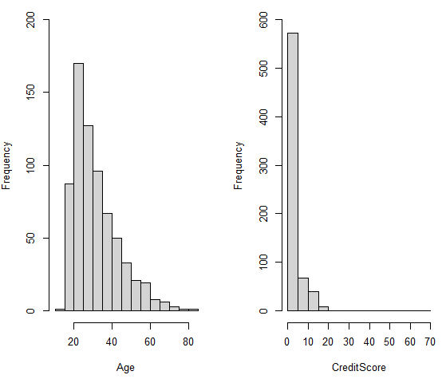
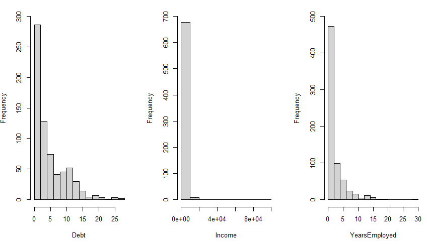

```{r setup, include=FALSE}
options(htmltools.dir.version = FALSE)
if (!require("knitr")) {
   install.packages("knitr")
   library(knitr)
}
if (!require("pander")) {
   install.packages("pander")
   library(pander)
}
if (!require("plotly")) {
   install.packages("plotly")
   library(plotly)
}
if (!require("ggplot2")) {
   install.packages("ggplot2")
   library(ggplot2)
}
knitr::opts_chunk$set(
                  fig.width=3, 
                  fig.height=3, 
                  fig.retina=12,
                  out.width = "100%",
                  cache = FALSE,
                  echo = FALSE,
                  message = FALSE, 
                  warning = FALSE,
                  hiline = TRUE
                  )
```


```{r xaringan-themer, include=FALSE, warning=FALSE}
library(xaringanthemer)
  style_duo_accent(primary_color = "#1F4257",
          secondary_color = "#380F2A",
          # fonts
          header_font_google = google_font("Martel"),
          text_font_google = google_font("Lato"),
          code_font_google = google_font("Fira Mono"))
  

```


```{r, include=FALSE}
 if (!require("xaringanthemer")) {
      install.packages("xaringanthemer")
      library(xaringanthemer)
     }
```

```{r, include=FALSE}
library(mlbench)
Credit.0 <- read.csv("https://raw.githubusercontent.com/Kyle-Weber/STA321/main/www/clean_dataset.csv", header = TRUE)
Credit = Credit.0


options(repos = c(CRAN = "https://cloud.r-project.org"))

if (!require("DT")) {
      install.packages("DT")
      library(DT)
     }

if (!require("plotly")) {
      install.packages("plotly")
      library(plotly)
     }


library(psych)
```


class: top, center
# Table of Contents


.left[

<li> Data Pre-Processing </li>
<br>
<li> Exploratory Analysis </li>
<br>
<li> Multiple Logistic Regression Models </li>
<br>
<li> Goodness-of-Fit </li>
<br>
<li> Odds Ratio  </li>
<br>
<li> Conclusion </li>

]
---
class: top, center
#   Data Pre-Processing 
<br>
.left[
<li>Data Transformation </li>
<br>
<li> Missing Values </li>
<br>
<li>Data Cleaning </li>
]


---
class: top, center
# Exploratory Analysis

.left[
- Pairwise Scatter Plots for Numerical Variables
]
```{r interactive-scatterplot-matrix, echo=FALSE, out.width="50%", out.height="50%"}
library(psych)
num.var <- c("Age", "YearsEmployed", "Income", "Debt", "CreditScore")

num.dat <- Credit[, num.var]

pairs.panels(num.dat, 
             method = "pearson", # correlation method
             hist.col = "#00AFBB",
             density = TRUE,  # show density plots
             ellipses = TRUE # show correlation ellipses
)
```


---
class: top, center
# Exploratory Analysis

.left[
-  Age and CreditScore Histograms
]
```{r, echo=FALSE, out.width="50%", out.height="50%", fig.align="center", fig.valign="top"}


```

---
class: top, center
# Exploratory Analysis
<br>

.left[
- Debt, Income, and YearsEmployed Histograms
]

```{r, echo=FALSE, out.width="70%", out.height="70%", fig.align="center", fig.valign="top"}


```

---
class: top, center
## Exploratory Analysis

.left[
- Grouping Variables
- Four Variables Grouped
- Example of Age Groupings:

]
```{r, echo=FALSE}
# Specify the breaks for each variable
age.breaks <- c(0, 17.0, 21.0, 26.0, 35.0, 50.0, 100)
income.breaks <- c(-1, 0.0, 5.0, 10.0, 300.0, 5000, Inf)
debt.breaks <- c(-1, 0.0, 0.6, 1.2, 5.0, 10.0, 40, Inf)
years.breaks <- c(-1, 0.0, 1.0, 3.0, 5.0, 10.0, 50, Inf)

# Use cut() function to create new columns with group labels
Credit$grp.Age <- cut(Credit$Age, breaks = age.breaks, labels = c("0-17", "17-21", "21-26", "26-35", "35-50", "50-100"))
Credit$grp.Income <- cut(Credit$Income, breaks = income.breaks, labels = c("0", "0.1-5", "5-10", "10-300", "300-5000", "5000+"))
Credit$grp.Debt <- cut(Credit$Debt, breaks = debt.breaks, labels = c("0", "0.1-0.6", "0.61-1.2", "1.21-5.0", "5.1-10.0", "10.1-40", "40+"))
Credit$grp.YearsEmployed <- cut(Credit$YearsEmployed, breaks = years.breaks, labels = c("0", "0.1-1.0", "3.0-5.0", "5.0-10.0", "10.1-50.0", "50+", ""))


# Display the count of observations in each group for the different variables
kable(table(Credit$grp.Age), caption = "Groups of Age")

```


---
class: top, center
# Logistic Regression Model

.left[
- Full Model
]
```{r interactive-logistic-regression-summary, echo=FALSE, fig.cap="Summary of inferential statistics of the full model", out.width="100%"}


# Load necessary libraries
library(knitr)
library(kableExtra)
library(DT)

# Fit the logistic regression model
full.model <- glm(Approved ~ grp.Debt + grp.Age + grp.Income + Gender + BankCustomer + Ethnicity + grp.YearsEmployed + PriorDefault + Employed + DriversLicense + Citizen,
                  family = binomial(link = "logit"),  
                  data = Credit)  

# Create a summary table
summary_table <- as.data.frame(summary(full.model)$coef)

# Round all values to 7 decimal places
rounded_summary_table <- round(summary_table, digits = 4)

datatable(rounded_summary_table, 
          options = list(dom = 't', 
                         pageLength = 40, 
                         scrollY = '200px',  # Adjust the height as needed
                         scrollCollapse = TRUE))


```


---
class: top, center
# Logistic Regression Model
.left[
- Reduced Model
<br>
<br>
- Variables Removed Manually
]
```{r interactive-reduced-model-summary, echo=FALSE, fig.cap="Summary of inferential statistics of the reduced model", out.width="100%"}
# Load necessary libraries
library(knitr)
library(kableExtra)
library(DT)

# Fit the logistic regression model
reduced.model <- glm(Approved ~ grp.Income + grp.Debt + Employed + BankCustomer + PriorDefault, 
                     family = binomial(link = "logit"),  # logit(p) = log(p/(1-p))!
                     data = Credit) 

# Create a summary table
summary_table_reduced <- as.data.frame(summary(reduced.model)$coef)

# Round all values to 7 decimal places
rounded_summary_table_reduced <- round(summary_table_reduced, digits = 4)

datatable(rounded_summary_table_reduced, 
          options = list(dom = 't', 
                         pageLength = 40, 
                         scrollY = '200px',  # Adjust the height as needed
                         scrollCollapse = TRUE))


```


---
class: top, center
# Logistic Regression Model
.left[
- Final Model
<br>
- Automatic variable selection
]
```{r interactive-final-model-summary, echo=FALSE, fig.cap="Summary of inferential statistics of the final model", out.width="40%", fig.height=2}
# Load necessary libraries
library(knitr)
library(kableExtra)
library(DT)

## automatic variable selection
library(MASS)
final.model.forward <- stepAIC(reduced.model, 
                                scope = list(lower = formula(reduced.model), upper = formula(full.model)),
                                direction = "forward",   # forward selection
                                trace = 0   
)

# Create a summary table
summary_table_final <- as.data.frame(summary(final.model.forward)$coef)

# Round all values to 7 decimal places
rounded_summary_table_final <- round(summary_table_final, digits = 4)

datatable(rounded_summary_table_final, 
          options = list(dom = 't', 
                         pageLength = 40, 
                         scrollY = '200px',  # Adjust the height as needed
                         scrollCollapse = TRUE))


```


---
class: top, center
# Goodness-of-fit Model Comparison
.left[
- Comparison of three logistic regression models
<br>
<br>
- Final model has a slightly better Deviance and AIC
]
<br>
<br>
```{r interactive-goodness-of-fit, echo=FALSE, fig.cap="Comparison of global goodness-of-fit statistics", out.width="50%", fig.height=4}
# Load necessary libraries
library(knitr)
library(kableExtra)
library(DT)

# Define the global goodness-of-fit function
global.measure <- function(s.logit) {
  dev.resid <- s.logit$deviance
  dev.0.resid <- s.logit$null.deviance
  aic <- s.logit$aic
  goodness <- cbind(Deviance.residual = dev.resid, Null.Deviance.Residual = dev.0.resid, AIC = aic)
  goodness
}

# Calculate global goodness-of-fit measures
goodness <- rbind(full.model = global.measure(full.model),
                  reduced.model = global.measure(reduced.model),
                  final.model = global.measure(final.model.forward))
row.names(goodness) <- c("full.model", "reduced.model", "final.model")

# Round all values to 7 decimal places
rounded_goodness <- round(goodness, digits = 7)

# Make the table interactive
datatable(rounded_goodness, 
          options = list(dom = 't', pageLength = 6))


```


---
class: top, center
# Odds Ratio  Analysis
.left[
- Practical interpretation
<br>
- Influential Predictors
<br>
]
```{r interactive-odds-ratio, echo=FALSE, fig.cap="Summary Stats with Odds Ratios", out.width="100%", fig.height=4}
# Load necessary libraries
library(knitr)
library(kableExtra)
library(DT)


# Calculate odds ratio
model.coef.stats <- summary(final.model.forward)$coef
odds.ratio <- exp(coef(final.model.forward))

# Combine coefficients and odds ratio
out.stats <- cbind(model.coef.stats, odds.ratio) 


# Round all values to 6 decimal places
rounded_stats <- round(out.stats, digits = 4)


datatable(rounded_stats, 
          options = list(dom = 't', 
                         pageLength = 40, 
                         scrollY = '200px',
                         scrollX = '50px'))

```


---
class: top, center
#   Conclusion
.left[
- Summary
<br>
<br>
<!-- Pairwise to regrouping the variables, regression models, final model, odds ratio,           -->
- Real-World Applicability 
<br>
<br>
<!-- This is useful in understanding which variables might impact your chances of succeeding in this case for credit card approval. It also lets you know what you might have to improve on, like reducing your debt or getting a job, making your chances of being approved higher.           -->
- Why a Regression Model?
<br>
<br>
<!-- Works great when the response variable is a binary categorical variable. So in situations where the answer you are looking for is either yes or no          -->
]

---
class: top, center
# References:


.left[
Quinlan,J. R.. Credit Approval. UCI Machine Learning Repository. https://doi.org/10.24432/C5FS30.
]

